# Goldencat Bank — Production DevOps Platform

A Spring Boot banking application deployed on AWS EKS with a full production-grade DevOps stack — covering CI/CD, GitOps, service mesh, observability, policy enforcement, disaster recovery, and infrastructure-as-code.

---

## Tech Stack

| Category | Tools |
|---|---|
| **Infrastructure & Cloud** |    |
| **Container Orchestration** |    |
| **CI/CD & GitOps** |     |
| **Service Mesh & Networking** |   |
| **Observability** |       |
| **Security & Policy** |    |
| **Disaster Recovery** |   |
| **AI** | -000000?style=for-the-badge&logo=groq&logoColor=white) |

---

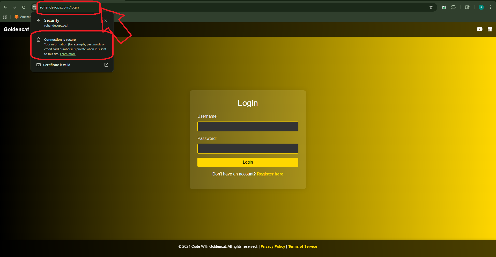
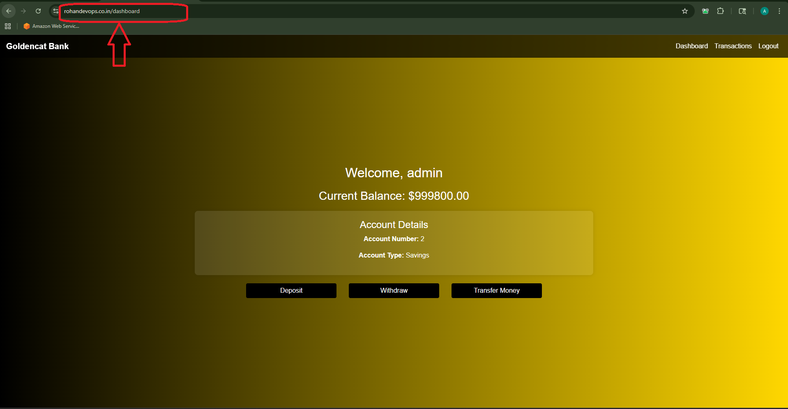
## What This Project Solves

| Problem | Solution |
|---|---|
| Manual image builds with no security gates | 6-stage Jenkins pipeline: SAST → SCA → image scan → ECR push |
| Secrets stored in plaintext or env vars | AWS Secrets Manager + External Secrets Operator syncing to K8s secrets via IRSA |
| Zero-downtime deploys with instant rollback | Argo Rollouts blue-green strategy with manual promotion gate |
| No cluster-level policy enforcement | Kyverno ClusterPolicy: non-root enforcement, resource limits, privilege escalation blocked |
| Node scaling done manually | Karpenter v1 NodePool/EC2NodeClass — spot + on-demand, consolidation every 30s |
| Distributed traces lost, no log correlation | OpenTelemetry → Tempo (traces) + Loki (logs) with Grafana trace-to-log linking |
| No backup strategy for K8s workloads | Velero scheduled backups every 6 hours to MinIO, 30-day retention |
| Terraform state unprotected and not locked | S3 backend with KMS encryption, versioning, object lock + DynamoDB state locking |
| Git credentials hardcoded in manifests | ExternalSecret pulling GitHub creds from Secrets Manager into ArgoCD repo secret |

---

## AWS Services

**Compute & Orchestration**
- EKS 1.31 — cluster with API + ConfigMap auth mode, public + private endpoints
- EC2 (SPOT) — m7i-flex.large node groups managed by Karpenter
- Karpenter — NodePool with spot/on-demand mix, drift enabled, consolidation on empty or underutilized nodes

**Networking**
- VPC — `10.0.0.0/16`, 6 subnets (2 public, 2 private-app, 2 private-data) across 2 AZs
- ALB — HTTPS termination, HTTP→HTTPS redirect, health checks against `/actuator/health`
- Route53 — A records for `rohandevops.co.in`, `api.rohandevops.co.in`, `www.rohandevops.co.in`
- ACM — wildcard cert with DNS validation via Route53

**Data & Storage**
- RDS MySQL 8.0 — Multi-AZ in prod, KMS-encrypted, automated backups, slow query logs to CloudWatch
- S3 — Terraform state backend, Loki log storage, Tempo trace storage; lifecycle to Glacier at 30 days
- DynamoDB — Terraform state locking with PITR enabled

**Security & Identity**
- KMS — envelope encryption for RDS, S3, CloudWatch logs; 30-day key rotation
- IAM IRSA — per-workload roles for app, Loki, Tempo, Velero, Jenkins, Karpenter; no static credentials in pods
- AWS Secrets Manager — DB credentials, GitHub tokens, SonarQube token, Gemini API key
- ECR — image repository with `scanOnPush=true`, native vulnerability scanning post-push

**Observability**
- CloudWatch — log groups for EKS application logs, error metric filter, alarm → SNS

---

## DevOps Toolchain

### CI/CD — Jenkins
7-stage Jenkinsfile triggered on GitHub push:
1. Pull all secrets from AWS Secrets Manager (no credentials in Jenkins itself)
2. Maven build + package
3. SonarQube SAST — quality gate enforced, blocks on `ERROR` status
4. OWASP Dependency Check SCA — fails on any critical CVE
5. Docker build + Trivy image scan — reports on all severities, table output archived
6. Push to ECR — enables native scan, waits 60s, logs finding counts
7. GitOps tag bump — `sed` updates `values-prod.yaml`, commits and pushes, ArgoCD picks up the diff

### GitOps — ArgoCD
- App-of-Apps pattern: `root-banking-stack` Application points at `argocd/` directory, recurses all child Applications
- ApplicationSet manages banking-platform, istio-base, and sonarqube from a single template
- `selfHeal: true` across all apps; `prune: true` removes drift
- `RespectIgnoreDifferences` on Karpenter, Kyverno, and Velero CRDs to suppress webhook caBundle noise
- ArgoCD repo credentials sourced from ExternalSecret (not a static K8s secret)

### Deployment Strategy — Argo Rollouts
- Blue-green Rollout with `autoPromotionEnabled: false` — preview service receives new pods, promotion is manual
- `scaleDownDelaySeconds: 60` keeps old ReplicaSet alive briefly post-promotion
- AnalysisTemplate queries Prometheus success rate (`>= 99.5%`) over 5 × 1-minute windows before promotion is approved

### Service Mesh — Istio
- `PeerAuthentication` set to `STRICT` mTLS across `istio-system`
- Gateway + VirtualService routing for `api.rohandevops.co.in` and `rohandevops.co.in`
- TLS terminated at the Istio ingress gateway using a cert-manager `Certificate` from Let's Encrypt
- ACME HTTP-01 challenge routed through the same gateway via dedicated VirtualService entries
- DestinationRule: `LEAST_CONN` load balancing, outlier detection (ejects after 3× 5xx), connection pool limits
- Retry policy: 3 attempts, 2s per-try timeout, on `gateway-error,connect-failure,refused-stream`
- Kiali for live service graph with Prometheus + Tempo integration

### Observability Stack
- **Prometheus** (kube-prometheus-stack 67.3.0) — 15-day retention, gp3 PVC, scrapes banking app via ServiceMonitor
- **Grafana** — persistent storage, banking dashboard (JVM memory + HTTP rate panels), datasources for Prometheus / Loki / Tempo wired via ConfigMap
- **Loki** (loki-stack 2.10.2) — S3-backed (`boltdb-shipper`), promtail DaemonSet, IRSA for S3 write access
- **Tempo** (1.10.1) — receives OTLP traces from OTel Collector, trace-to-log linking via Grafana datasource config
- **OpenTelemetry Collector** — OTLP gRPC/HTTP receiver, fans out traces → Tempo, logs → Loki
- **OpenTelemetry Java Agent** — baked into Docker image, auto-instruments Spring Boot at runtime; no code changes required

PrometheusRules cover: service down, 5xx rate > 5%, P95 latency > 1.5s, CPU/memory pressure, OOMKilled, node not ready, pod crash-looping, DB connection pool saturation, slow queries, SSL cert expiry < 15 days, Velero backup failures, traffic drop > 50%, traffic spike > 2×, and auth failure rate.

### Policy Enforcement — Kyverno
- `ClusterPolicy: banking-guardrails` in `Enforce` mode
- Blocks any pod in `banking-prod` missing CPU/memory limits
- Blocks root-user containers cluster-wide (excludes `monitoring`, `velero`, `kyverno`, `kube-system`, `argocd`, `jenkins`, `istio-system`)
- `ignoreDifferences` on Kyverno CRDs and webhook CA bundles to prevent ArgoCD sync loops

### Disaster Recovery — Velero + MinIO
- Velero 11.4.0 deployed via ArgoCD with the AWS plugin for EBS snapshots
- MinIO running in-cluster as the S3-compatible backup target (`velero-backups` bucket, 20Gi PVC)
- Schedule: every 6 hours (`0 */6 * * *`), TTL 720h (30 days), scoped to `banking-prod` namespace
- Velero namespace has a ResourceQuota (8Gi memory, 4 CPU requests) to prevent backup jobs from impacting production workloads
- `snapshotVolumes: false` — stateful data handled by RDS automated backups separately

### Infrastructure — Terraform
- Modular structure: `networking`, `security`, `eks`, `iam`, `alb`, `rds`, `route53`, `acm`, `s3`, `cloudwatch`
- Remote state in S3 (KMS-encrypted, versioned, object lock GOVERNANCE mode, 30-day retention)
- DynamoDB lock table with PITR; deletion protection enabled in prod
- IRSA roles created via `terraform-aws-modules/iam` for Loki, Tempo, Karpenter, Jenkins, Velero
- GitHub Actions OIDC role for CI-triggered Terraform runs — no long-lived AWS keys in GitHub secrets
- Two workflows: `tf-bootstrap.yaml` (manual, one-time S3 + DynamoDB provisioning) and `tf-production.yaml` (push to main, runs Checkov + TFLint + plan + apply)

### Security Scanning Pipeline
- **SonarQube** — SAST, quality gate, hosted in-cluster at `sonarqube.rohandevops.co.in`
- **OWASP Dependency Check** — SCA on Maven dependencies, HTML + JSON reports archived in Jenkins
- **Trivy** — image scan post-build, JSON report archived; exit code 0 (non-blocking) with full severity output
- **ECR native scan** — `scanOnPush=true`, findings logged after 60s wait
- **Kyverno** — runtime admission control as the last enforcement layer

### AI-Assisted RCA
`scripts/ai_rca.py` — reads Jenkins pipeline logs from stdin, calls Groq API (Llama 3.1 8B), returns root cause, failed stage, and fix steps. API key pulled from Secrets Manager at pipeline start.

---

## Network & Security Architecture

NetworkPolicy on banking-prod pods:
- Ingress: only from `banking-prod`, `istio-system`, `monitoring` namespaces on port 8080
- Egress: DNS (UDP/TCP 53 to kube-system), MySQL (3306 to RDS CIDR), observability ports (9090, 3000, 3100, 4317/4318) to monitoring namespace

---

## Proof of Work

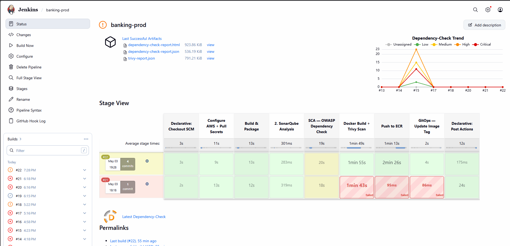
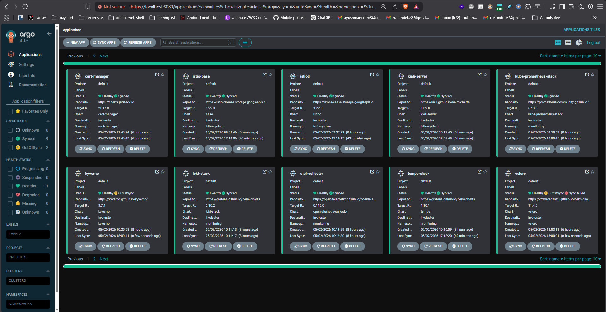
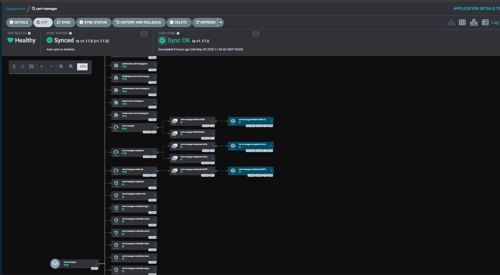
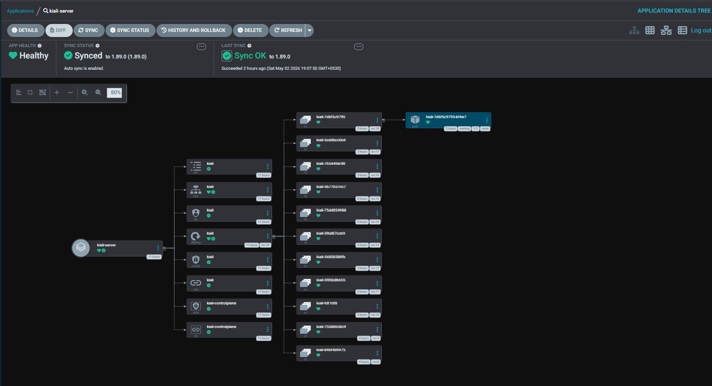
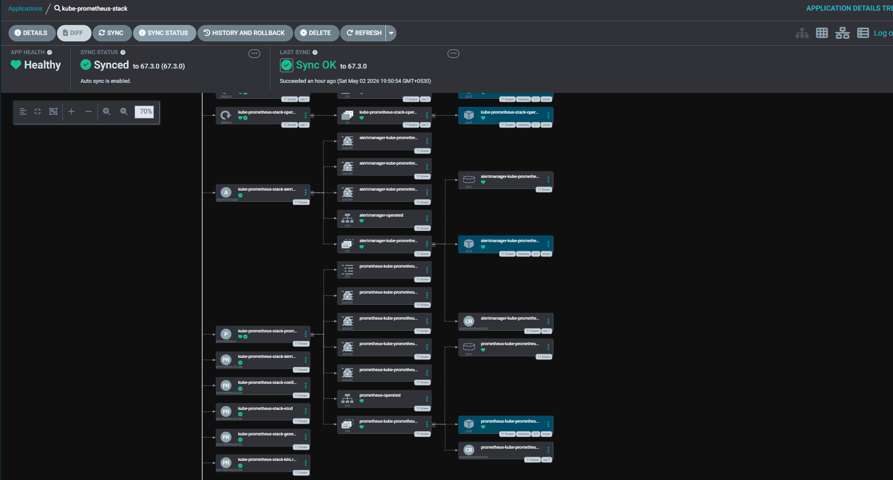
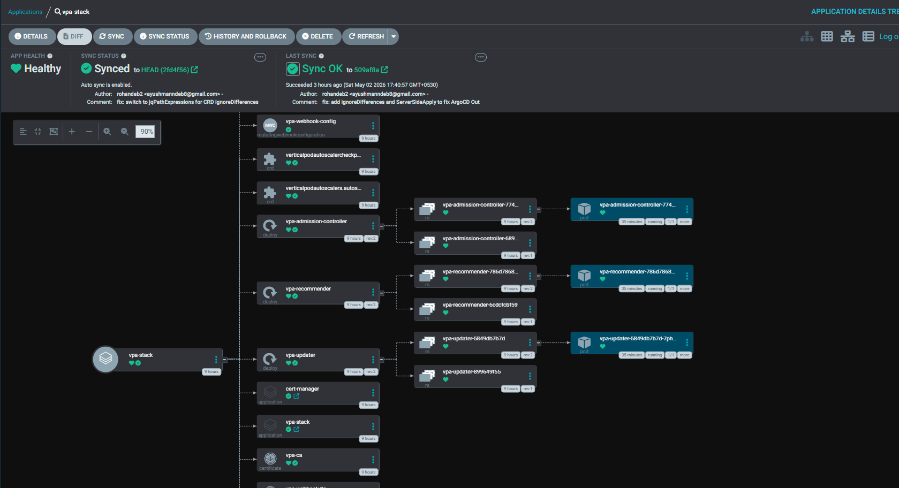
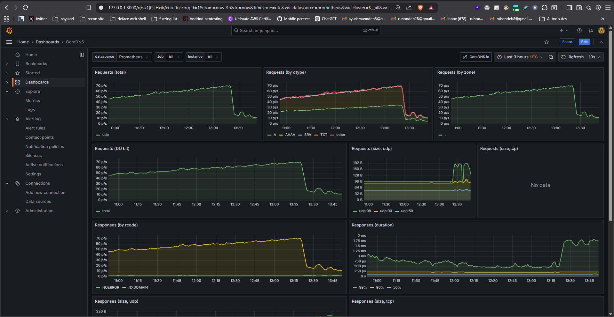
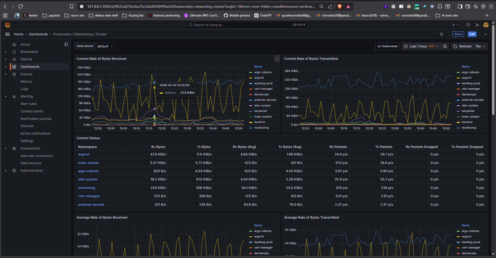
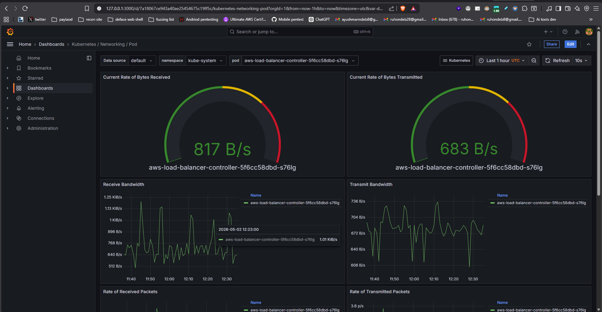
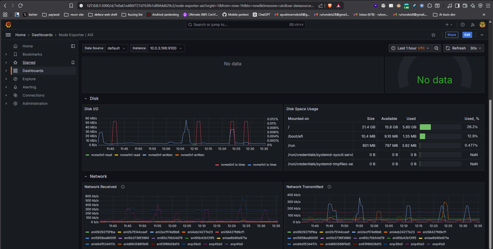
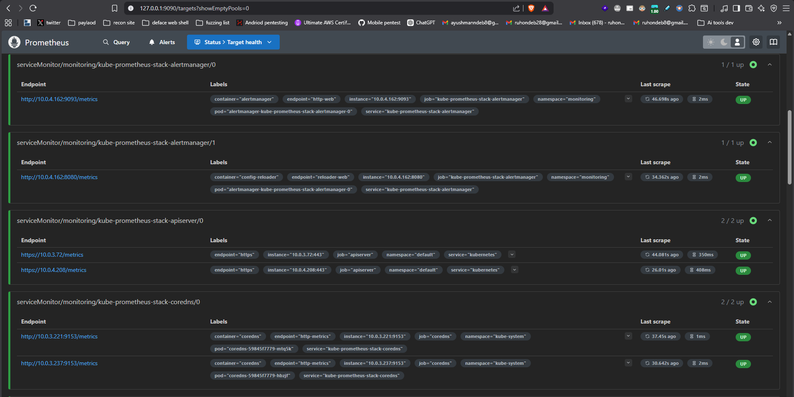
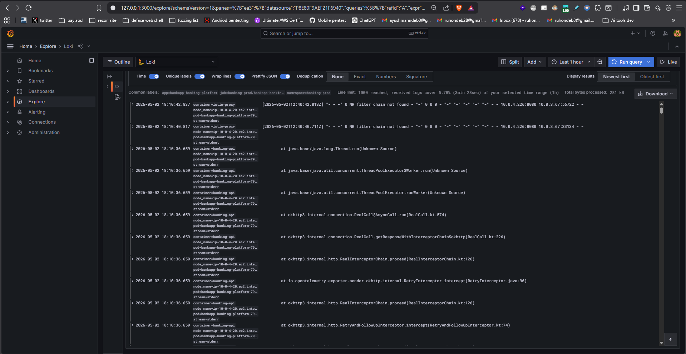
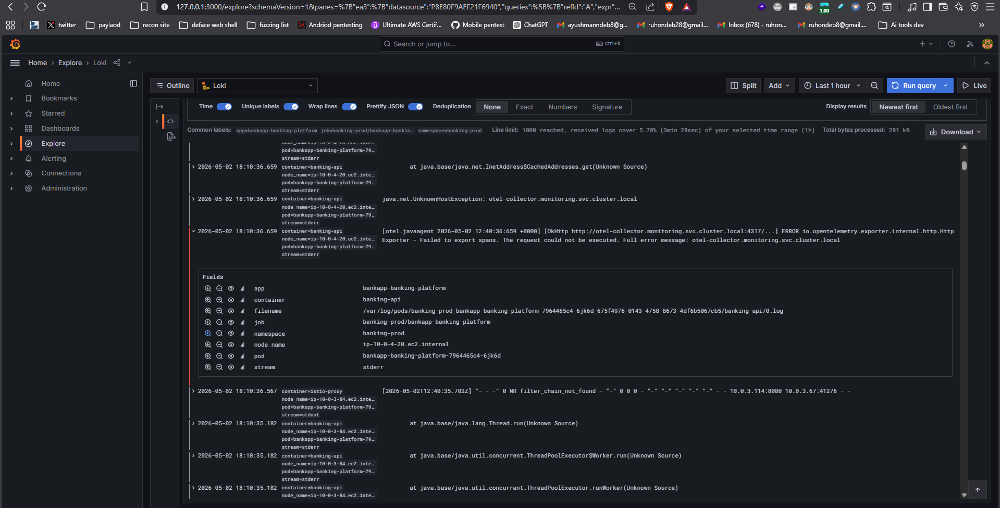
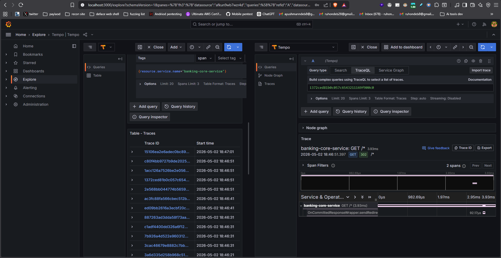
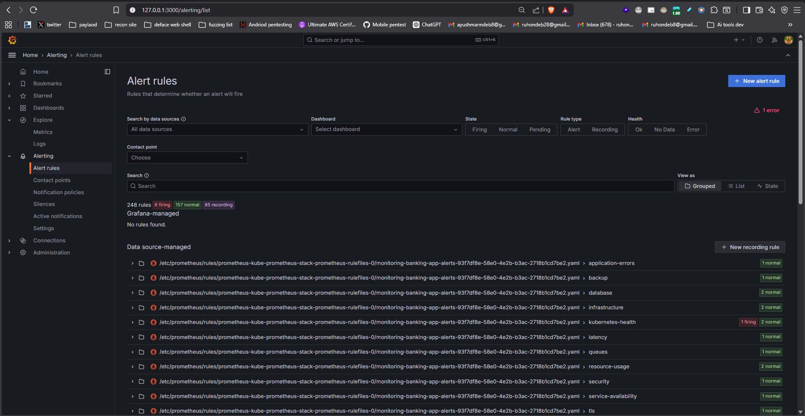
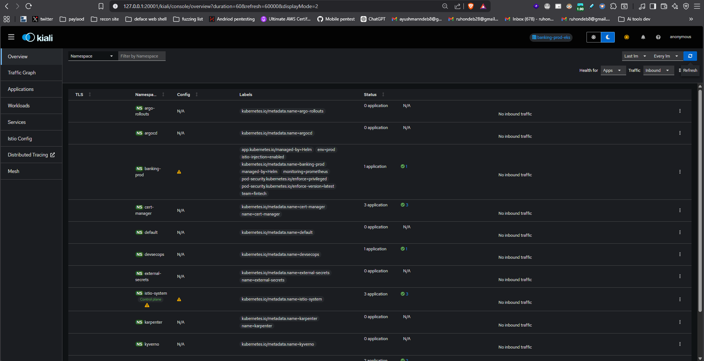
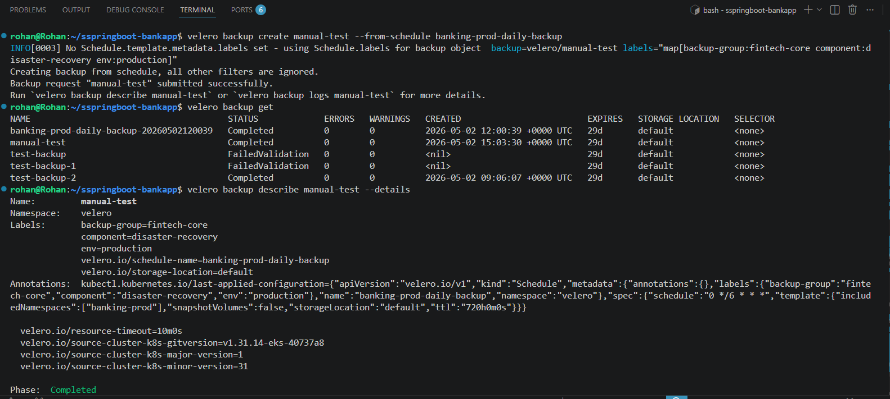
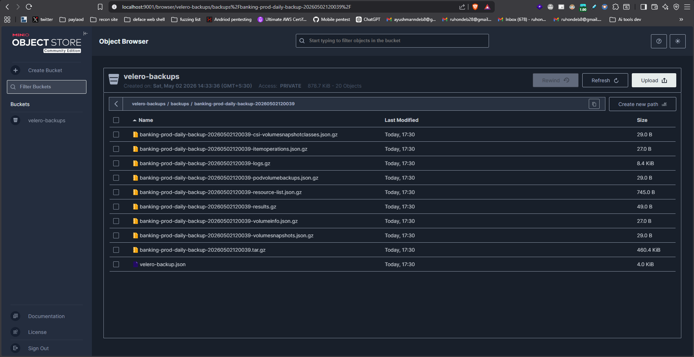
